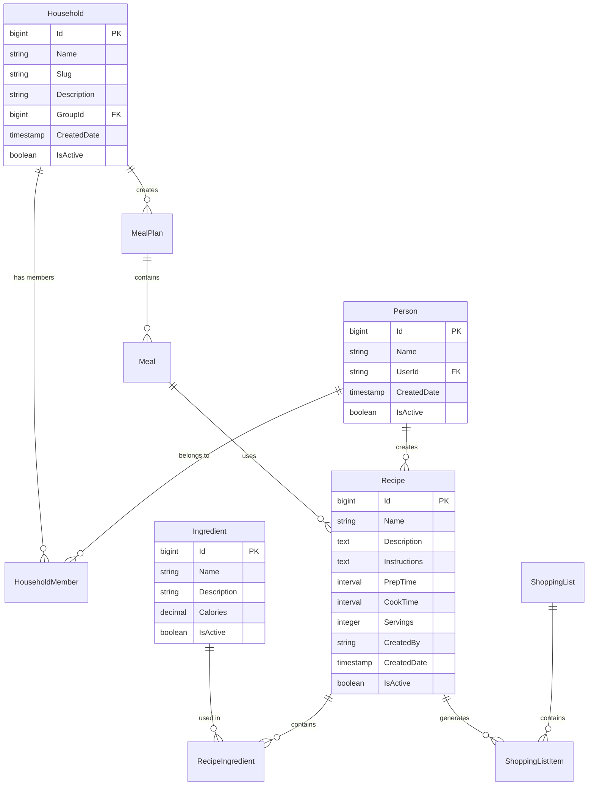

# 🗄️ Data Architecture & Database Design

## 📋 Table of Contents

1. [Database Schema Overview](#database-schema-overview)
2. [Domain-Driven Schema Organization](#domain-driven-schema-organization)
3. [Entity Relationships](#entity-relationships)
4. [Data Patterns & Strategies](#data-patterns--strategies)
5. [Performance Optimization](#performance-optimization)
6. [Data Migration Strategy](#data-migration-strategy)
7. [Data Quality & Integrity](#data-quality--integrity)
8. [Backup & Recovery](#backup--recovery)

## 🎯 Database Schema Overview

The NOM application uses **PostgreSQL 16+** with a **domain-driven schema organization** that provides clear separation of concerns and optimal performance.

### **Schema Organization**

```
nom_database/
├── 🔐 auth/                 # ASP.NET Identity (Users, Roles, Claims)
├── 👤 person/               # Person management & profiles
├── 🏠 plan/                 # Households, meal plans, restrictions
├── 🍳 recipe/               # Recipes, ingredients, nutrition
├── 🛒 shopping/             # Shopping lists, pantry, trips
├── 📊 reference/            # System reference data & lookups
├── 📏 measurement/          # Measurement units & conversions
├── 🥗 nutrient/             # Nutrients, guidelines, relationships
├── 📱 communication/        # Messaging system
├── ✅ curation/             # Content moderation & quality
├── 🔒 privacy/              # GDPR compliance & data rights
└── 📝 audit/                # Audit logging & compliance
```

### **Entity Count by Domain**

| Schema            | Tables | Entities | Purpose                         |
| ----------------- | ------ | -------- | ------------------------------- |
| **auth**          | 7      | 7        | ASP.NET Identity framework      |
| **person**        | 4      | 4        | User profiles & attributes      |
| **plan**          | 15     | 15       | Households, meal plans, goals   |
| **recipe**        | 12     | 12       | Recipes, ingredients, steps     |
| **shopping**      | 8      | 8        | Shopping lists & pantry         |
| **reference**     | 6      | 6        | System lookups & UI data        |
| **measurement**   | 5      | 5        | Units, conversions, preferences |
| **nutrient**      | 3      | 3        | Nutrition data & guidelines     |
| **communication** | 3      | 3        | Messaging & notifications       |
| **curation**      | 1      | 1        | Content quality management      |
| **privacy**       | 4      | 4        | GDPR compliance features        |
| **audit**         | 1      | 1        | System audit logging            |

**Total: 69 Tables, 69 Entities**

## 🏗️ Domain-Driven Schema Organization

### **Core Domain: Recipe Management**

```sql
-- recipe schema
CREATE SCHEMA recipe;

-- Core recipe entity
CREATE TABLE recipe.Recipe (
    Id bigserial PRIMARY KEY,
    Name varchar(255) NOT NULL,
    Description text,
    Instructions text,
    PrepTime interval,
    CookTime interval,
    TotalTime interval,
    Servings integer,
    CreatedBy varchar(450) NOT NULL,
    CreatedDate timestamp with time zone DEFAULT now(),
    ModifiedDate timestamp with time zone DEFAULT now(),
    IsActive boolean DEFAULT true
);

-- Recipe ingredients relationship
CREATE TABLE recipe.RecipeIngredient (
    Id bigserial PRIMARY KEY,
    RecipeId bigint NOT NULL REFERENCES recipe.Recipe(Id),
    IngredientId bigint NOT NULL REFERENCES recipe.Ingredient(Id),
    Quantity decimal(10,3),
    MeasurementId bigint REFERENCES measurement.Measurement(Id),
    Note text,
    SortOrder integer DEFAULT 0
);
```

### **Core Domain: Person & Household Management**

```sql
-- person schema
CREATE SCHEMA person;

-- Person entity (distinct from Identity users)
CREATE TABLE person.Person (
    Id bigserial PRIMARY KEY,
    Name varchar(255) NOT NULL,
    UserId varchar(450), -- Links to ASP.NET Identity
    CreatedDate timestamp with time zone DEFAULT now(),
    ModifiedDate timestamp with time zone DEFAULT now(),
    IsActive boolean DEFAULT true,

    CONSTRAINT UK_Person_UserId UNIQUE (UserId)
);

-- plan schema for households
CREATE SCHEMA plan;

-- Household entity
CREATE TABLE plan.Household (
    Id bigserial PRIMARY KEY,
    Name varchar(255) NOT NULL,
    Slug varchar(255),
    Description varchar(2047),
    GroupId bigint NOT NULL REFERENCES reference.Reference(Id),
    CreatedDate timestamp with time zone DEFAULT now(),
    ModifiedDate timestamp with time zone DEFAULT now(),
    IsActive boolean DEFAULT true
);

-- Household membership
CREATE TABLE plan.HouseholdMember (
    Id bigserial PRIMARY KEY,
    HouseholdId bigint NOT NULL REFERENCES plan.Household(Id),
    PersonId bigint NOT NULL REFERENCES person.Person(Id),
    Role varchar(50) DEFAULT 'Member',
    JoinedDate timestamp with time zone DEFAULT now(),
    IsActive boolean DEFAULT true,

    CONSTRAINT UK_HouseholdMember UNIQUE (HouseholdId, PersonId)
);
```

### **Measurement System (Table-Per-Hierarchy)**

```sql
-- measurement schema
CREATE SCHEMA measurement;

-- Base measurement entity (TPH pattern)
CREATE TABLE measurement.Measurement (
    Id bigserial PRIMARY KEY,
    Name varchar(255) NOT NULL,
    Symbol varchar(50),
    MeasurementType varchar(50) NOT NULL, -- Discriminator
    CategoryId bigint REFERENCES measurement.MeasurementCategory(Id),

    -- Base measurement properties
    BaseUnit varchar(255),
    ConversionFactor decimal(18,6),

    -- Ingredient-specific properties
    IngredientId bigint, -- For IngredientMeasurement

    -- Nutrient-specific properties
    NutrientId bigint, -- For NutrientMeasurement

    CreatedDate timestamp with time zone DEFAULT now(),
    ModifiedDate timestamp with time zone DEFAULT now(),
    IsActive boolean DEFAULT true
);

-- Measurement categories
CREATE TABLE measurement.MeasurementCategory (
    Id bigserial PRIMARY KEY,
    Name varchar(255) NOT NULL,
    Description text,
    SortOrder integer DEFAULT 0
);

-- Conversion relationships
CREATE TABLE measurement.MeasurementConversion (
    Id bigserial PRIMARY KEY,
    FromMeasurementId bigint NOT NULL REFERENCES measurement.Measurement(Id),
    ToMeasurementId bigint NOT NULL REFERENCES measurement.Measurement(Id),
    ConversionFactor decimal(18,6) NOT NULL,
    IsActive boolean DEFAULT true,

    CONSTRAINT UK_MeasurementConversion UNIQUE (FromMeasurementId, ToMeasurementId)
);
```

## 🔗 Entity Relationships

### **Core Entity Relationship Diagram**



### **Advanced Relationships**

#### **Many-to-Many with Attributes**

```csharp
// Recipe-Ingredient relationship with quantity
public class RecipeIngredientEntity : BaseEntity
{
    public long RecipeId { get; set; }
    public virtual RecipeEntity Recipe { get; set; }

    public long IngredientId { get; set; }
    public virtual IngredientEntity Ingredient { get; set; }

    public decimal? Quantity { get; set; }
    public long? MeasurementId { get; set; }
    public virtual MeasurementEntity? Measurement { get; set; }

    public string? Note { get; set; }
    public int SortOrder { get; set; }
}
```

#### **Hierarchical Data**

```csharp
// Reference data hierarchy
public class ReferenceEntity : BaseEntity
{
    public string Name { get; set; }
    public string? Description { get; set; }
    public long DiscriminatorId { get; set; }

    // Self-referencing hierarchy
    public long? ParentId { get; set; }
    public virtual ReferenceEntity? Parent { get; set; }
    public virtual ICollection<ReferenceEntity> Children { get; set; }

    public int SortOrder { get; set; }
}
```

## 🚀 Data Patterns & Strategies

### **Base Entity Pattern**

```csharp
// All entities inherit from BaseEntity
public abstract class BaseEntity
{
    [Key]
    public long Id { get; set; }

    public DateTime CreatedDate { get; set; } = DateTime.UtcNow;
    public DateTime ModifiedDate { get; set; } = DateTime.UtcNow;
    public bool IsActive { get; set; } = true;
}

// Expiration pattern for time-limited entities
public abstract class BaseExpirationEntity : BaseEntity
{
    public DateTime? ExpirationDate { get; set; }
    public bool IsExpired => ExpirationDate.HasValue && ExpirationDate.Value < DateTime.UtcNow;
}

// Limited use pattern for tokens/invitations
public abstract class BaseExpirationLimitedUseEntity : BaseExpirationEntity
{
    public int MaxUses { get; set; } = 1;
    public int CurrentUses { get; set; } = 0;
    public bool IsUseLimitReached => CurrentUses >= MaxUses;
    public bool IsUsable => IsActive && !IsExpired && !IsUseLimitReached;
}
```

### **Audit Pattern**

```csharp
// Comprehensive audit logging
public class AuditLogEntryEntity : BaseEntity
{
    public string UserId { get; set; }
    public string EntityName { get; set; }
    public string EntityId { get; set; }
    public string Action { get; set; } // CREATE, UPDATE, DELETE
    public string? OldValues { get; set; } // JSON
    public string? NewValues { get; set; } // JSON
    public string IpAddress { get; set; }
    public string UserAgent { get; set; }
    public DateTime Timestamp { get; set; }
}
```

### **Soft Delete Pattern**

```csharp
// Soft delete implementation
public interface ISoftDeletable
{
    bool IsActive { get; set; }
    DateTime? DeletedDate { get; set; }
    string? DeletedBy { get; set; }
}

// Global query filter
modelBuilder.Entity<RecipeEntity>()
    .HasQueryFilter(e => e.IsActive);
```

## ⚡ Performance Optimization

### **Indexing Strategy**

#### **Primary Indexes**

```sql
-- High-performance indexes for common queries
CREATE INDEX CONCURRENTLY idx_recipe_name_search
ON recipe.Recipe USING gin(to_tsvector('english', Name));

CREATE INDEX CONCURRENTLY idx_recipe_active_created
ON recipe.Recipe (IsActive, CreatedDate DESC)
WHERE IsActive = true;

CREATE INDEX CONCURRENTLY idx_ingredient_nutrition
ON nutrient.IngredientNutrient (IngredientId, NutrientId);

CREATE INDEX CONCURRENTLY idx_person_user_lookup
ON person.Person (UserId)
WHERE UserId IS NOT NULL;

CREATE INDEX CONCURRENTLY idx_household_member_lookup
ON plan.HouseholdMember (HouseholdId, PersonId)
WHERE IsActive = true;
```

#### **Composite Indexes**

```sql
-- Multi-column indexes for complex queries
CREATE INDEX CONCURRENTLY idx_meal_plan_date_household
ON plan.Meal (HouseholdId, PlannedDate, MealTypeId)
WHERE IsActive = true;

CREATE INDEX CONCURRENTLY idx_shopping_list_household_status
ON shopping.ShoppingList (HouseholdId, Status, CreatedDate DESC);

CREATE INDEX CONCURRENTLY idx_recipe_ingredient_active
ON recipe.RecipeIngredient (RecipeId, IngredientId)
WHERE IsActive = true;
```

### **Query Optimization Patterns**

#### **Efficient Loading Strategies**

```csharp
// AsNoTracking for read-only queries
public async Task<IEnumerable<RecipeResponse>> GetRecipesAsync(int page, int size)
{
    return await _dbContext.Recipes
        .AsNoTracking()
        .Where(r => r.IsActive)
        .OrderBy(r => r.Name)
        .Skip(page * size)
        .Take(size)
        .Select(r => new RecipeResponse
        {
            Id = r.Id,
            Name = r.Name,
            Description = r.Description,
            PrepTime = r.PrepTime,
            CookTime = r.CookTime,
            Servings = r.Servings
        })
        .ToListAsync();
}

// Include related data efficiently
public async Task<Recipe> GetRecipeWithIngredientsAsync(long id)
{
    return await _dbContext.Recipes
        .Include(r => r.RecipeIngredients)
            .ThenInclude(ri => ri.Ingredient)
        .Include(r => r.RecipeIngredients)
            .ThenInclude(ri => ri.Measurement)
        .FirstOrDefaultAsync(r => r.Id == id && r.IsActive);
}
```

#### **Compiled Queries**

```csharp
// Pre-compiled queries for performance
private static readonly Func<ApplicationDbContext, long, Task<Recipe?>> GetRecipeByIdCompiled =
    EF.CompileAsyncQuery((ApplicationDbContext context, long id) =>
        context.Recipes
            .Where(r => r.Id == id && r.IsActive)
            .FirstOrDefault());

public async Task<Recipe?> GetRecipeAsync(long id)
{
    return await GetRecipeByIdCompiled(_dbContext, id);
}
```

### **Materialized Views**

```sql
-- Materialized view for recipe search
CREATE MATERIALIZED VIEW recipe.RecipeSearchView AS
SELECT
    r.Id,
    r.Name,
    r.Description,
    r.PrepTime,
    r.CookTime,
    r.Servings,
    string_agg(i.Name, ', ') AS Ingredients,
    avg(n.Calories) AS AvgCalories,
    count(ri.Id) AS IngredientCount,
    to_tsvector('english', r.Name || ' ' || coalesce(r.Description, '')) AS SearchVector
FROM recipe.Recipe r
LEFT JOIN recipe.RecipeIngredient ri ON r.Id = ri.RecipeId
LEFT JOIN recipe.Ingredient i ON ri.IngredientId = i.Id
LEFT JOIN nutrient.IngredientNutrient in ON i.Id = in.IngredientId
LEFT JOIN nutrient.Nutrient n ON in.NutrientId = n.Id
WHERE r.IsActive = true
GROUP BY r.Id, r.Name, r.Description, r.PrepTime, r.CookTime, r.Servings;

-- Index on materialized view
CREATE INDEX idx_recipe_search_vector
ON recipe.RecipeSearchView USING gin(SearchVector);

-- Refresh strategy
REFRESH MATERIALIZED VIEW CONCURRENTLY recipe.RecipeSearchView;
```

## 🔗 Entity Relationships

### **Core Entity Models**

#### **Person Domain**

```csharp
[Table("Person", Schema = "person")]
public class PersonEntity : BaseEntity
{
    [Required, MaxLength(255)]
    public string Name { get; set; } = string.Empty;

    public string? UserId { get; set; } // Link to ASP.NET Identity

    // Navigation properties
    public virtual ICollection<PlanParticipantEntity> PlanParticipations { get; set; }
    public virtual ICollection<PersonAttributeEntity> Attributes { get; set; }
    public virtual ICollection<RestrictionEntity> Restrictions { get; set; }
    public virtual ICollection<HouseholdMemberEntity> HouseholdMemberships { get; set; }
}

[Table("PersonAttribute", Schema = "person")]
public class PersonAttributeEntity : BaseEntity
{
    public long PersonId { get; set; }
    public virtual PersonEntity Person { get; set; }

    public long AttributeTypeId { get; set; } // Reference to attribute types
    public virtual ReferenceEntity AttributeType { get; set; }

    public string? Value { get; set; }
    public decimal? NumericValue { get; set; }
    public DateTime? DateValue { get; set; }
}
```

#### **Recipe Domain**

```csharp
[Table("Recipe", Schema = "recipe")]
public class RecipeEntity : BaseEntity
{
    [Required, MaxLength(255)]
    public string Name { get; set; } = string.Empty;

    public string? Description { get; set; }
    public string? Instructions { get; set; }

    public TimeSpan? PrepTime { get; set; }
    public TimeSpan? CookTime { get; set; }
    public TimeSpan? TotalTime { get; set; }

    public int? Servings { get; set; }

    [Required, MaxLength(450)]
    public string CreatedBy { get; set; } = string.Empty;

    // Navigation properties
    public virtual ICollection<RecipeIngredientEntity> RecipeIngredients { get; set; }
    public virtual ICollection<RecipeStepEntity> RecipeSteps { get; set; }
    public virtual ICollection<RecipeNutrientEntity> RecipeNutrients { get; set; }
    public virtual ICollection<MealEntity> Meals { get; set; }
}

[Table("RecipeIngredient", Schema = "recipe")]
public class RecipeIngredientEntity : BaseEntity
{
    public long RecipeId { get; set; }
    public virtual RecipeEntity Recipe { get; set; }

    public long IngredientId { get; set; }
    public virtual IngredientEntity Ingredient { get; set; }

    public decimal? Quantity { get; set; }
    public long? MeasurementId { get; set; }
    public virtual MeasurementEntity? Measurement { get; set; }

    public string? Note { get; set; }
    public int SortOrder { get; set; } = 0;
}
```

#### **Measurement Domain (TPH Pattern)**

```csharp
// Table-Per-Hierarchy base class
[Table("Measurement", Schema = "measurement")]
public abstract class MeasurementEntity : BaseEntity
{
    [Required, MaxLength(255)]
    public string Name { get; set; } = string.Empty;

    [MaxLength(50)]
    public string? Symbol { get; set; }

    public long? CategoryId { get; set; }
    public virtual MeasurementCategoryEntity? Category { get; set; }
}

// Concrete implementations
public class BaseMeasurementEntity : MeasurementEntity
{
    [MaxLength(255)]
    public string? BaseUnit { get; set; }

    public decimal? ConversionFactor { get; set; }
}

public class IngredientMeasurementEntity : MeasurementEntity
{
    public long IngredientId { get; set; }
    public virtual IngredientEntity Ingredient { get; set; }

    public decimal? DensityGramsPerMl { get; set; }
    public decimal? TypicalPortionSize { get; set; }
}

public class NutrientMeasurementEntity : MeasurementEntity
{
    public long NutrientId { get; set; }
    public virtual NutrientEntity Nutrient { get; set; }

    public decimal? RecommendedDailyValue { get; set; }
    public decimal? TolerableUpperLimit { get; set; }
}
```

### **Complex Relationships**

#### **Household Multi-Tenancy**

```csharp
// Household-scoped entities
public class MealPlanEntity : BaseEntity
{
    public long HouseholdId { get; set; }
    public virtual HouseholdEntity Household { get; set; }

    public string Name { get; set; }
    public DateTime StartDate { get; set; }
    public DateTime EndDate { get; set; }

    // Meals within this plan
    public virtual ICollection<MealEntity> Meals { get; set; }
}

// Meal planning with constraints
public class MealEntity : BaseEntity
{
    public long MealPlanId { get; set; }
    public virtual MealPlanEntity MealPlan { get; set; }

    public DateTime PlannedDate { get; set; }
    public long MealTypeId { get; set; } // Breakfast, Lunch, Dinner, Snack
    public virtual ReferenceEntity MealType { get; set; }

    public long? RecipeId { get; set; }
    public virtual RecipeEntity? Recipe { get; set; }

    public string? Notes { get; set; }
}
```

#### **Shopping List Generation**

```csharp
// Auto-generated shopping lists from meal plans
public class ShoppingListEntity : BaseEntity
{
    public long HouseholdId { get; set; }
    public virtual HouseholdEntity Household { get; set; }

    public string Name { get; set; }
    public string Status { get; set; } = "Active"; // Active, Completed, Archived

    // Generation metadata
    public long? GeneratedFromMealPlanId { get; set; }
    public virtual MealPlanEntity? GeneratedFromMealPlan { get; set; }

    public DateTime? GeneratedDate { get; set; }

    // Shopping list items
    public virtual ICollection<ShoppingListItemEntity> Items { get; set; }
}

public class ShoppingListItemEntity : BaseEntity
{
    public long ShoppingListId { get; set; }
    public virtual ShoppingListEntity ShoppingList { get; set; }

    public long? IngredientId { get; set; }
    public virtual IngredientEntity? Ingredient { get; set; }

    public string ItemName { get; set; } // Fallback if no ingredient
    public decimal? Quantity { get; set; }
    public long? MeasurementId { get; set; }
    public virtual MeasurementEntity? Measurement { get; set; }

    public bool IsCompleted { get; set; } = false;
    public string? Notes { get; set; }

    // Categorization
    public long? CategoryId { get; set; }
    public virtual ShoppingListCategoryEntity? Category { get; set; }
}
```

## 📊 Data Quality & Integrity

### **Data Validation Patterns**

#### **Entity Validation**

```csharp
// Fluent validation in Entity Framework
protected override void OnModelCreating(ModelBuilder modelBuilder)
{
    // Recipe validation
    modelBuilder.Entity<RecipeEntity>(entity =>
    {
        entity.Property(e => e.Name)
            .IsRequired()
            .HasMaxLength(255);

        entity.Property(e => e.Servings)
            .HasAnnotation("Range", new[] { 1, 100 });

        entity.HasCheckConstraint("CK_Recipe_Servings", "\"Servings\" > 0 AND \"Servings\" <= 100");
    });

    // Measurement validation
    modelBuilder.Entity<MeasurementEntity>(entity =>
    {
        entity.HasCheckConstraint("CK_Measurement_ConversionFactor",
            "\"ConversionFactor\" IS NULL OR \"ConversionFactor\" > 0");
    });
}
```

#### **Business Rule Constraints**

```sql
-- Database-level business rules
ALTER TABLE recipe.RecipeIngredient
ADD CONSTRAINT CK_RecipeIngredient_Quantity
CHECK (Quantity IS NULL OR Quantity > 0);

ALTER TABLE plan.Meal
ADD CONSTRAINT CK_Meal_PlannedDate
CHECK (PlannedDate >= CURRENT_DATE - INTERVAL '1 year');

ALTER TABLE shopping.ShoppingListItem
ADD CONSTRAINT CK_ShoppingListItem_Name
CHECK (
    (IngredientId IS NOT NULL) OR
    (ItemName IS NOT NULL AND length(trim(ItemName)) > 0)
);
```

### **Data Import Quality**

#### **Quality Scoring Algorithm**

```csharp
public class IngredientQualityScorer
{
    public int CalculateQualityScore(RawIngredient ingredient)
    {
        var score = 0;

        // Base score for foundation foods
        if (ingredient.DataType == "foundation_food") score += 50;
        else if (ingredient.DataType == "survey_food") score += 30;
        else if (ingredient.DataType == "branded_food") score += 10;

        // Nutrient completeness bonus
        score += Math.Min(ingredient.NutrientCount * 2, 30);

        // Freshness bonus (publication year)
        var yearBonus = Math.Max(0, (ingredient.PublicationYear - 2015) * 2);
        score += Math.Min(yearBonus, 20);

        // Name quality (length penalty for overly long names)
        if (ingredient.Name.Length > 100) score -= 10;
        if (ingredient.Name.Length > 200) score -= 20;

        return Math.Max(0, Math.Min(100, score));
    }
}
```

#### **Data Filtering Rules**

```csharp
public class IngredientFilter
{
    public bool ShouldIncludeIngredient(RawIngredient ingredient)
    {
        // Quality threshold
        if (ingredient.QualityScore < 40) return false;

        // Exclude overly specific branded items
        if (ingredient.DataType == "branded_food" &&
            ingredient.Name.Length > 150) return false;

        // Require minimum nutrition data
        if (ingredient.NutrientCount < 5) return false;

        // Exclude discontinued items
        if (ingredient.PublicationYear < 2010) return false;

        return true;
    }
}
```

## 🔄 Data Migration Strategy

### **Entity Framework Migrations**

#### **Migration Patterns**

```csharp
// Custom migration base class
public abstract class CustomMigration : Migration
{
    protected void CreateDomainSchema(string schemaName, string description)
    {
        migrationBuilder.Sql($@"
            CREATE SCHEMA IF NOT EXISTS {schemaName};
            COMMENT ON SCHEMA {schemaName} IS '{description}';
        ");
    }

    protected void CreateAuditTrigger(string tableName, string schemaName)
    {
        migrationBuilder.Sql($@"
            CREATE TRIGGER audit_{tableName.ToLower()}
            AFTER INSERT OR UPDATE OR DELETE ON {schemaName}.{tableName}
            FOR EACH ROW EXECUTE FUNCTION audit.audit_trigger();
        ");
    }
}
```

#### **Schema Evolution**

```csharp
// Example migration with data preservation
public partial class AddMeasurementSystem : CustomMigration
{
    protected override void Up(MigrationBuilder migrationBuilder)
    {
        // Create measurement schema
        CreateDomainSchema("measurement", "Measurement units and conversions");

        // Create measurement tables
        migrationBuilder.CreateTable(
            name: "Measurement",
            schema: "measurement",
            columns: table => new
            {
                Id = table.Column<long>(type: "bigint", nullable: false)
                    .Annotation("Npgsql:ValueGenerationStrategy",
                        NpgsqlValueGenerationStrategy.IdentityByDefaultColumn),
                Name = table.Column<string>(type: "character varying(255)",
                    maxLength: 255, nullable: false),
                // ... other columns
            });

        // Migrate existing data
        migrationBuilder.Sql(@"
            INSERT INTO measurement.Measurement (Name, Symbol, MeasurementType)
            SELECT Name, Symbol, 'Base'
            FROM reference.Reference
            WHERE DiscriminatorId = 5000;
        ");
    }
}
```

### **Data Seeding Strategy**

#### **Reference Data Seeding**

```csharp
public class ReferenceDataSeeder
{
    public async Task SeedAsync(ApplicationDbContext context)
    {
        // Seed in dependency order
        await SeedReferenceDiscriminators(context);
        await SeedMealTypes(context);
        await SeedDietaryRestrictions(context);
        await SeedMeasurementCategories(context);
        await SeedCuisineTypes(context);

        await context.SaveChangesAsync();
    }

    private async Task SeedMealTypes(ApplicationDbContext context)
    {
        var mealTypes = new[]
        {
            new ReferenceEntity { Name = "Breakfast", DiscriminatorId = 1001, SortOrder = 1 },
            new ReferenceEntity { Name = "Lunch", DiscriminatorId = 1001, SortOrder = 2 },
            new ReferenceEntity { Name = "Dinner", DiscriminatorId = 1001, SortOrder = 3 },
            new ReferenceEntity { Name = "Snack", DiscriminatorId = 1001, SortOrder = 4 }
        };

        foreach (var mealType in mealTypes)
        {
            if (!await context.References.AnyAsync(r =>
                r.Name == mealType.Name && r.DiscriminatorId == mealType.DiscriminatorId))
            {
                context.References.Add(mealType);
            }
        }
    }
}
```

## 🔍 Advanced Data Patterns

### **Multi-Tenancy Pattern**

```csharp
// Household-scoped multi-tenancy
public interface IHouseholdScoped
{
    long HouseholdId { get; set; }
    HouseholdEntity Household { get; set; }
}

// Global filter for household isolation
modelBuilder.Entity<MealPlanEntity>()
    .HasQueryFilter(e => e.HouseholdId == GetCurrentHouseholdId());

// Service implementation
public class MealPlanOrchestrationService
{
    private long GetCurrentHouseholdId()
    {
        // Extract from JWT claims or context
        return _httpContextAccessor.HttpContext.User
            .FindFirst("HouseholdId")?.Value?.ToLong() ?? 0;
    }
}
```

### **Event Sourcing Pattern**

```csharp
// Event sourcing for audit and replay
public class RecipeEvent : BaseEntity
{
    public long RecipeId { get; set; }
    public string EventType { get; set; } // Created, Updated, Deleted
    public string EventData { get; set; } // JSON payload
    public string UserId { get; set; }
    public DateTime EventTimestamp { get; set; }
}

// Event store implementation
public class EventStore
{
    public async Task AppendEventAsync<T>(long aggregateId, T eventData) where T : IEvent
    {
        var eventEntity = new RecipeEvent
        {
            RecipeId = aggregateId,
            EventType = typeof(T).Name,
            EventData = JsonSerializer.Serialize(eventData),
            UserId = GetCurrentUserId(),
            EventTimestamp = DateTime.UtcNow
        };

        _dbContext.RecipeEvents.Add(eventEntity);
        await _dbContext.SaveChangesAsync();
    }
}
```

### **CQRS Pattern Implementation**

```csharp
// Command and Query separation
public interface IRecipeQueries
{
    Task<Recipe> GetRecipeAsync(long id);
    Task<IEnumerable<Recipe>> SearchRecipesAsync(string query);
    Task<IEnumerable<Recipe>> GetRecipesByHouseholdAsync(long householdId);
}

public interface IRecipeCommands
{
    Task<Recipe> CreateRecipeAsync(CreateRecipeRequest request);
    Task<Recipe> UpdateRecipeAsync(long id, UpdateRecipeRequest request);
    Task DeleteRecipeAsync(long id);
}

// Separate implementations optimized for their purpose
public class RecipeQueryService : IRecipeQueries
{
    // Optimized for read operations
    // Uses AsNoTracking, projections, compiled queries
}

public class RecipeCommandService : IRecipeCommands
{
    // Optimized for write operations
    // Full entity tracking, validation, business rules
}
```

## 📈 Performance Monitoring

### **Database Performance Metrics**

```sql
-- Query performance monitoring
CREATE VIEW performance.SlowQueries AS
SELECT
    query,
    calls,
    total_time,
    mean_time,
    max_time,
    rows
FROM pg_stat_statements
WHERE mean_time > 100
ORDER BY mean_time DESC;

-- Index usage monitoring
CREATE VIEW performance.IndexUsage AS
SELECT
    schemaname,
    tablename,
    indexname,
    idx_tup_read,
    idx_tup_fetch,
    idx_scan
FROM pg_stat_user_indexes
ORDER BY idx_scan DESC;
```

### **Application Performance Patterns**

```csharp
// Performance monitoring service
public class PerformanceMonitor
{
    public async Task<T> MeasureAsync<T>(string operationName, Func<Task<T>> operation)
    {
        var stopwatch = Stopwatch.StartNew();

        try
        {
            var result = await operation();

            _logger.LogInformation("Operation {OperationName} completed in {ElapsedMs}ms",
                operationName, stopwatch.ElapsedMilliseconds);

            return result;
        }
        catch (Exception ex)
        {
            _logger.LogError(ex, "Operation {OperationName} failed after {ElapsedMs}ms",
                operationName, stopwatch.ElapsedMilliseconds);
            throw;
        }
    }
}
```

## 🛡️ Data Security

### **Encryption at Rest**

```sql
-- Sensitive data encryption
CREATE EXTENSION IF NOT EXISTS pgcrypto;

-- Encrypted fields
ALTER TABLE person.PersonAttribute
ADD COLUMN EncryptedValue bytea;

-- Encryption functions
CREATE OR REPLACE FUNCTION encrypt_sensitive_data(data text)
RETURNS bytea AS $$
BEGIN
    RETURN pgp_sym_encrypt(data, current_setting('app.encryption_key'));
END;
$$ LANGUAGE plpgsql;
```

### **Row-Level Security**

```sql
-- Enable RLS for household isolation
ALTER TABLE plan.MealPlan ENABLE ROW LEVEL SECURITY;

-- Create policy for household access
CREATE POLICY household_isolation ON plan.MealPlan
    USING (HouseholdId = current_setting('app.current_household_id')::bigint);
```

### **Data Anonymization**

```csharp
// Privacy compliance - data anonymization
public class DataAnonymizer
{
    public async Task AnonymizePersonDataAsync(long personId)
    {
        var person = await _dbContext.Persons.FindAsync(personId);
        if (person != null)
        {
            person.Name = $"Anonymized User {person.Id}";
            person.UserId = null;

            // Anonymize related data
            var attributes = await _dbContext.PersonAttributes
                .Where(pa => pa.PersonId == personId)
                .ToListAsync();

            foreach (var attr in attributes)
            {
                attr.Value = "[REDACTED]";
                attr.NumericValue = null;
                attr.DateValue = null;
            }

            await _dbContext.SaveChangesAsync();
        }
    }
}
```

---

## 🎯 Data Architecture Summary

The NOM data architecture provides:

- ✅ **Domain-Driven Organization** - Clear schema separation by business domain
- ✅ **Advanced Patterns** - TPH, CQRS, Event Sourcing, Multi-tenancy
- ✅ **Performance Optimization** - Indexing, materialized views, compiled queries
- ✅ **Security & Privacy** - Encryption, RLS, GDPR compliance
- ✅ **Data Quality** - Quality scoring, validation, integrity constraints
- ✅ **Scalability** - Optimized for growth and high performance

**The data architecture supports enterprise-scale applications with 8,049 high-quality ingredients and comprehensive nutrition data!** 📊
